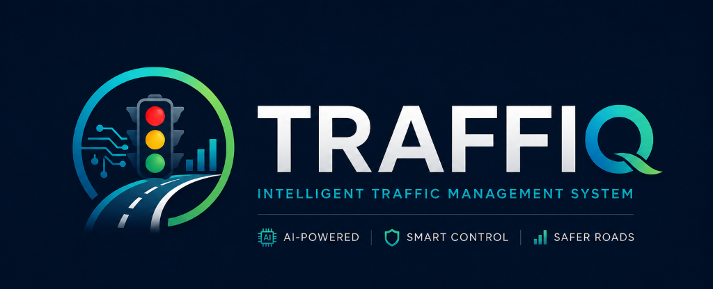
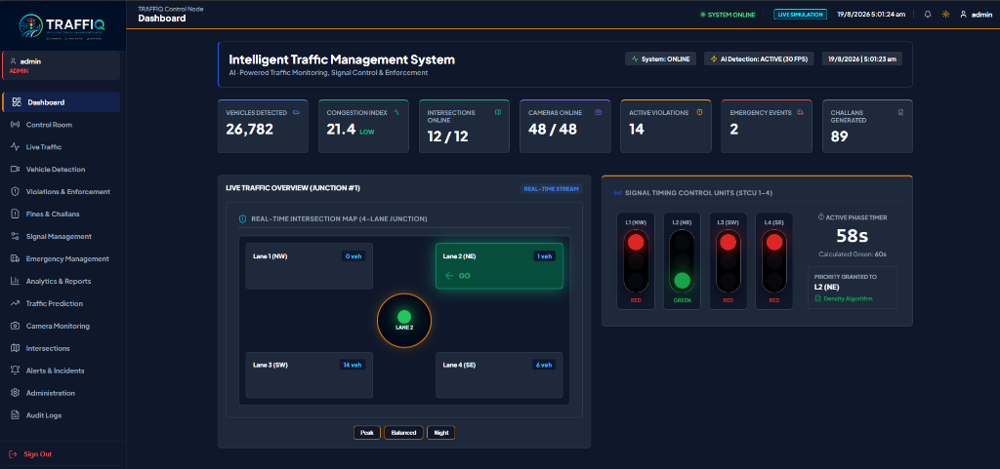
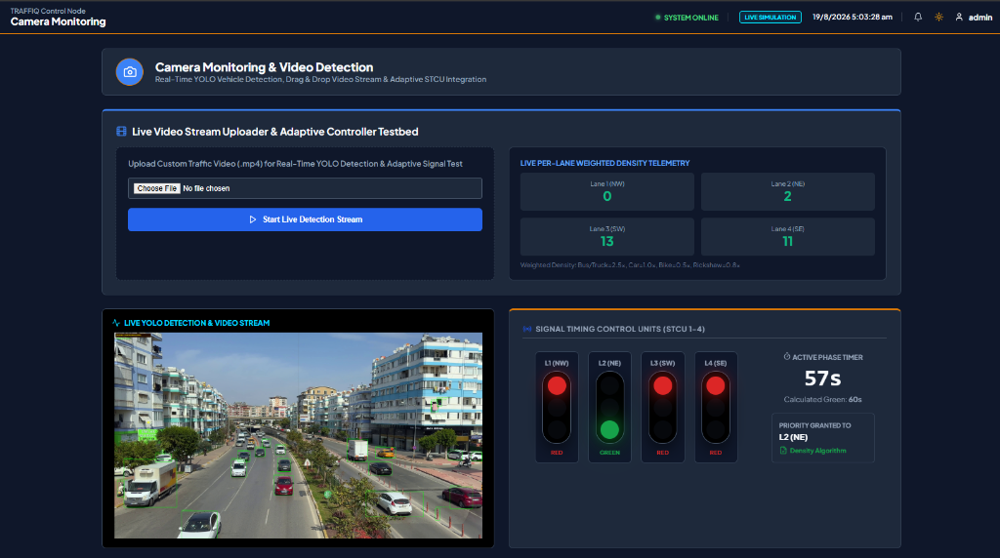
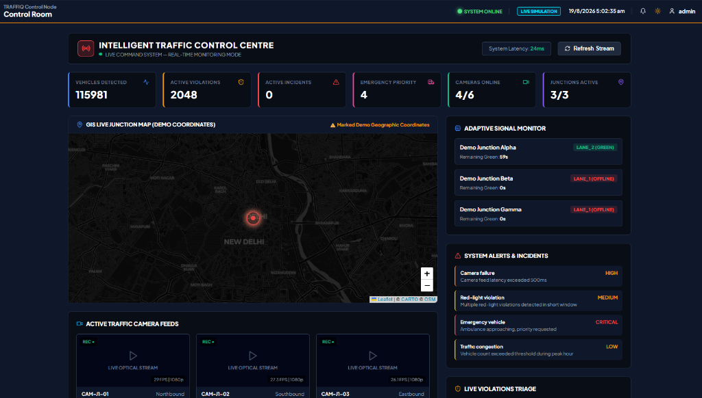
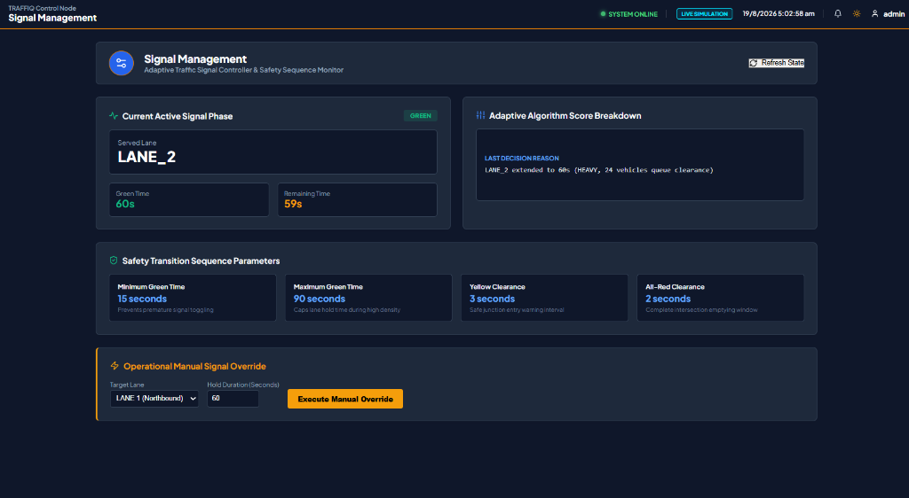
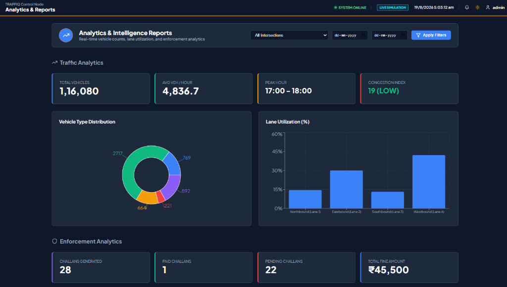
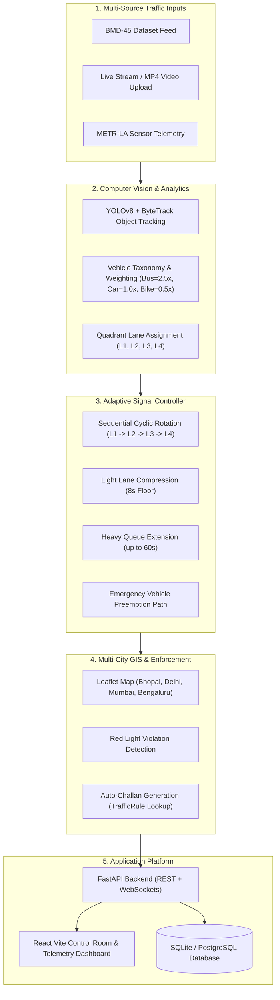

<div align="center">
  <a href="docs/screenshots/logo.png">
    
  </a>
</div>

<br />

# TRAFFIQ — Intelligent Traffic Management & Adaptive Signal Control System

[](https://fastapi.tiangolo.com)
[](https://reactjs.org)
[](https://ultralytics.com)
[](LICENSE)

**TRAFFIQ** is an enterprise-grade, end-to-end intelligent traffic management platform engineered for real-time computer vision vehicle detection, weighted density estimation, cyclic fairness-preserving adaptive signal control, multi-city GIS mapping, and automated violation enforcement.

---

## 🖥️ Executive Command Center Dashboard



> **Real-Time Traffic Command**: Comprehensive operational telemetry displaying active vehicle counts, congestion index, camera heartbeat statuses, active violations triage, emergency events, and live Signal Timing Control Unit (STCU) phase states.

---

## 🎥 Subsystem Modules & Live Previews

### 1. Camera Monitoring & Live YOLO Video Detection Testbed



- **Drag-and-Drop Video Uploader**: Upload custom `.mp4` video footage up to 500MB with OpenCV format validation and progress reporting.
- **YOLOv8 + ByteTrack Object Tracking**: Real-time vehicle detection with quadrant-based lane assignment and class weighting (Bus/Truck = 2.5x, Car = 1.0x, Bike = 0.5x).
- **Live STCU Synchronization**: Automatically feeds density counts directly into the adaptive signal controller to trigger real-time signal timing adjustments.

---

### 2. GIS Control Room & Multi-City Live Command



- **Interactive Dark-Mode GIS Map**: Leaflet map plotting real-world Indian junctions (Bhopal, New Delhi, Mumbai, Bengaluru) with real coordinates and live status markers.
- **Live Incidents & Alert Stream**: Real-time monitoring of camera latency spikes, red-light violations, and emergency vehicle priority requests.

---

### 3. Adaptive Signal Controller & Safety Transition Engine



- **Cyclic Round-Robin Rotation**: Guaranteed $L_1 \rightarrow L_2 \rightarrow L_3 \rightarrow L_4 \rightarrow L_1$ sequential phase serving without starvation.
- **Dynamic Phase Compression & Extension**: Compresses light lanes down to an 8s safety floor while extending heavy queues up to 60s max green time.
- **Safety Transitions & Manual Overrides**: Enforces 3s yellow clearance, 2s all-red clearance, and admin manual phase override holds.

---

### 4. Analytics & Enforcement Intelligence Reports



- **Dynamic Lane Utilization**: Real percentage share per lane calculated on-the-fly from actual vehicle crossing telemetry.
- **Enforcement & Fine Aggregation**: Automatic tracking of generated challans, payment statuses, and total fine collection.
- **Interactive Multi-Filter**: Filter reports by specific intersection node and date range (`date_from` to `date_to`).

---

## 🏗️ System Architecture



---

## 🚀 Quick Start & Deployment

### Option 1: Docker Compose (Recommended)

Run the complete platform (PostgreSQL, FastAPI Backend, React Frontend, and AI Worker) with a single command:

```bash
docker-compose up --build -d
```

- **React Control Room**: `http://localhost:5173`
- **FastAPI API & OpenAPI Docs**: `http://localhost:8000/docs`
- **PostgreSQL Database**: `localhost:5432`

---

### Option 2: Local Python & Node.js Development Setup

#### 1. Backend Setup

```bash
cd backend
python -m venv venv
# On Windows: venv\Scripts\activate | On Linux/Mac: source venv/bin/activate
pip install -r requirements.txt

# Start FastAPI Uvicorn Server on port 8000
python -m uvicorn app.main:app --host 127.0.0.1 --port 8000
```

#### 2. Frontend Setup

```bash
cd frontend
npm install
npm run dev
```

Open [http://localhost:5173](http://localhost:5173) in your browser.

---

## 🧪 Automated Testing & Quality Assurance

Execute the complete 14-test Pytest suite covering adaptive controller rotation, density phase compression, red-light violation detection, officer challan approval, and API health:

```bash
cd backend
python -m pytest tests/ -v
```

```text
============================= test session starts =============================
collected 14 items

tests/test_adaptive.py::test_1_strict_rotation_order_never_jumps_out_of_turn PASSED [  7%]
tests/test_adaptive.py::test_2_green_time_is_strictly_bounded PASSED     [ 14%]
tests/test_adaptive.py::test_3_heavy_lane_compression_and_extension PASSED [ 21%]
tests/test_adaptive.py::test_4_fresh_per_cycle_split_recomputation PASSED [ 28%]
tests/test_adaptive.py::test_5_anti_starvation_guarantee PASSED          [ 35%]
tests/test_adaptive.py::test_6_emergency_preemption_interrupt PASSED     [ 42%]
tests/test_api_v1.py::test_api_v1_health PASSED                          [ 50%]
tests/test_api_v1.py::test_login_and_auth_me PASSED                      [ 57%]
tests/test_api_v1.py::test_control_room_summary PASSED                   [ 64%]
tests/test_e2e_pipeline.py::test_centralized_vehicle_taxonomy PASSED     [ 71%]
tests/test_e2e_pipeline.py::test_persistent_vehicle_tracking_and_deduplication PASSED [ 78%]
tests/test_e2e_pipeline.py::test_anpr_honest_reporting PASSED            [ 85%]
tests/test_e2e_pipeline.py::test_violation_to_challan_master_rule_lookup PASSED [ 92%]
tests/test_violation_challan.py::test_red_light_violation_detection_and_approval_challan_flow PASSED [100%]

======================= 14 passed, 15 warnings in 1.34s =======================
```

---

## 📑 Core API Endpoints

| Method | Endpoint | Description |
| :--- | :--- | :--- |
| `POST` | `/api/stream/upload` | Upload `.mp4` video feed to start live YOLO detection & adaptive stream |
| `GET` | `/api/stream/status` | Returns stream status, frame count, YOLO status, and error states |
| `GET` | `/api/stream/video` | MJPEG real-time annotated video stream |
| `GET` | `/api/signal/status` | Current active STCU signal phase & live countdown timer |
| `POST` | `/api/signal/override` | Execute manual operational signal phase override |
| `POST` | `/api/vehicles/detections` | Ingest vehicle detection & trigger red-light violation checks |
| `PUT` | `/api/violations/{id}/status` | Review violation & auto-generate linked `Challan` on officer approval |
| `GET` | `/api/intersections` | List GIS intersection nodes with real lat/lng, city & address |
| `GET` | `/api/analytics/reports` | Dynamic analytics reports with intersection & date range filters |
| `POST` | `/api/admin/seed-demo-data` | Admin endpoint for seeding sample demo challans |
| `GET` | `/ws/traffic` | WebSocket real-time telemetry broadcaster |

---

## 📜 License

Distributed under the MIT License. See `LICENSE` for details.
